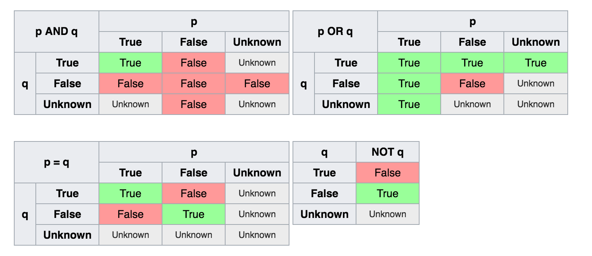

# In Relation to Data

or the more racy title:

S.Q.L. Relations

---

# What is an RDBMS?

- Relational Database Management System
- A database that stores a set of rows in a table
- Each row represents a record
- A record has one or more columns where you can store a specific piece of information
- For today, use analogy of Excel
    - Workbook = database
    - Sheet = table
    - Row = record
    - Column = cell

---

# Why Use an RDBMS?

- Efficient storage/organization of data
    - Saves disk space
    - Avoid needing to write code to read/write data
    - Fast retrieval of subsets of data
- Standard way of retrieving data via SQL
    - Many, many Business Intelligence tools leverage SQL to create reports
- Consistent way to update and delete information
    - Safer, more specific, than find/replace

---

# Who uses RDBMS?

- Virtually any program that saves/retrieves data
    - PoS
    - WebApps
    - Inventory Management
    - Finance
- You should too!

---

# What RDBMSes Are Available?
- Oracle
- MS SQL Server
- PostgreSQL
- MySQL
- SQLite

---

# When did RDBMS Come About?

- [History of RDBMS](https://upload.wikimedia.org/wikipedia/commons/a/a2/RDBMS_timeline-2.svg)

---

# How Does an RDBMS Work?

- Concrete implementation of Relational Algebra
    - Select
    - Project
    - Set operations
    - Joins
    - Most commonly represented as SQL
- Uses DDL/SQL to define, store, and then query information

---

# How to Use an RDBMS

- Map out logical data model
    - What tables?
    - What columns?
    - What relationships?
- Translate into DDL
    - Create table/column/constraints
- Load in Data
- Query your heart out!

---

# Logical Data Model

- ER Diagram represents tables and relationships
- Most tables should have a unique ID for each record
    - Called the "primary key"
    - Can be a "Natural Key" or a "Surrogate Key"
    - Can be compound, but, yuck
- Many tables will have columns that store the primary key of related tables
    - Called a "foreign key reference"

---

# Reading ER Diagrams

- [Lucid Charts has a good summary](https://www.lucidchart.com/pages/ER-diagram-symbols-and-meaning)
- [Rails ERD uses a slightly different notation](https://voormedia.github.io/rails-erd/gallery.html)
- Or this [sketchy one](https://yuml.me/diagram/scruffy/class/%5BRubygem%5D%201-*%3E%20%5BOwnership%5D,%20%5BRubygem%5D%201-*%3E%20%5BSubscription%5D,%20%5BRubygem%5D%201-*%3E%20%5BVersion%5D,%20%5BRubygem%5D%201-1%3E%20%5BLinkset%5D,%20%5BRubygem%5D%201-*%3E%20%5BDependency%5D,%20%5BVersion%5D%201-*%3E%20%5BDependency%5D,%20%5BUser%5D%201-*%3E%20%5BOwnership%5D,%20%5BUser%5D%201-*%3E%20%5BSubscription%5D,%20%5BUser%5D%201-*%3E%20%5BWebHook%5D)
- There are still [others](http://grivina.com/diagram/entity-relationship-diagram-symbols/)

---

# Defining Your Data

- Define the *schema* for a database using Data Definition Language (DDL)
    - CREATE/DROP
        - Add or remove tables/columns/constraints
    - Constraints
        - Unique
        - Not Null
        - Foreign Key
    - ALTER/RENAME/TRUNCATE

---

# Example of DDL

```DDL
CREATE TABLE public.care_site
(
    care_site_id integer NOT NULL,
    location_id integer,
    organization_id integer,
    place_of_service_concept_id integer,
    care_site_source_value text COLLATE pg_catalog."default",
    place_of_service_source_value text COLLATE pg_catalog."default",
    CONSTRAINT care_site_pk PRIMARY KEY (care_site_id),
    CONSTRAINT care_site_location_fk FOREIGN KEY (location_id)
        REFERENCES public.location (location_id) MATCH SIMPLE
        ON UPDATE NO ACTION
        ON DELETE NO ACTION,
    CONSTRAINT care_site_organization_fk FOREIGN KEY (organization_id)
        REFERENCES public.organization (organization_id) MATCH SIMPLE
        ON UPDATE NO ACTION
        ON DELETE NO ACTION
)
```

---

# Loading in Data

- INSERT statements
    - Can be combined with DDL to pull data from existing tables into new tables
- Load from external files
    - CSV
    - TSV
    - Foreign Data Wrappers
    - Amazon S3

---

# Loading Data Is Hard

- I rarely, if ever, get issue-free data files
- CSV isn't really standardized, despite [RFC 4180](http://www.digitalpreservation.gov/formats/fdd/fdd000323.shtml)
    - Excel reads/writes CSV in non-standard ways
    - Some RDBMSes are pretty inflexible about how they load in CSV data
- File encodings are a huge problem
    - i.e. How do you represent é?
    - ISO-8859-1 (Windows Latin) vs ASCII vs UTF-8
- New lines aren't even standard
    - Unix uses LF ("\n")
    - Older Macs used CR ("\r")
    - Windows uses both CR+LF ("\r\n")
- Hence the proliferation of ETL tools/processes

---

# Structured Query Language

- Declarative language used for querying data
- SELECT x FROM y WHERE z

---

# SQLtorial

I wrote [a small CLI program](https://github.com/outcomesinsights/sqltorial) to turn SQL statements into a [Markdown](https://guides.github.com/features/mastering-markdown/) document

---

# Shortcomings of RDBMS

- Installation and maintenance of RDBMS is non-trivial
- SQL as a language
- NULL is a tricky concept
- Query optimization
- ORM

---

# Installation and Maintenance

- Installing a database _can_ be pretty straightforward
- But configuration is often confusing
    - Lots of knobs and dials to turn to "tune" database to specific needs
- User accounts
    - Permissions on connections/tables/columns
    - [Don't let this happen to you!](https://thehackernews.com/2017/02/iot-teddy-bear.html)
- Disk space issues
    - How to keep from filling up the disk

---

# S != "Standardized"

- Though there is an ANSI standard for SQL, each RDBMS has its own dialect and there are major differences between
- Names of types
- Conversion between types
- Date parsing
- Date manipulation
- Major operations supported, especially set operations
    - `EXCEPT`
    - `INTERSECT`

---

# NULL != NULL

NULL is used to represent missing or unknown data, resulting in sometimes non-intuitive logic when reasoning about predicates.

*

\* Grabbed from https://en.wikipedia.org/wiki/SQL

---

# Query Optimization

- RDBMS uses a Query Planner to decide the best way to execute the query
- The Query Planner is a bit of a black box
- You can try to fee the Query Planner different indexes
- You can get an explanation of the plan from the planner
- You can sometimes restructure the query itself to yield performance gains

---

# ORM - Common & Awkward

In the late 90's and continuing today, Object Oriented Programmers concocted a means to store their objects into an RDBMS.  They called it Obect-Relational Mapping (ORM).

There are many ORM libraries out there.  Ruby on Rails uses ActiveRecord, arguably one of the easiest ORMs to use, which is one factor for why Rails became so popular so fast.

However ORM is not a panacea and many OO programmers opted to find (or invent) other DBM systems.

---

# Other DBM Systems

- NoSQL
    - Key/Value
        - Redis
        - Couchbase
    - Document-oriented
        - MongoDB
        - RethinkDB
- Graph
    - Neo4J
- Map-reduce
    - Hadoop
- ISAM
    - ctree

---

# So, Why RDBMS?

- Maintains data integrity
- Easy way to efficiently store/retrieve data
- SQL is _relatively_ easy to learn
- All the bells and whistles needed to handle large amounts of data
- Long, long history

---

# Data Integrity

- Checking accounts are often stored in a database
- If you transfer money from Alice account to Bob, you must decrement Alice's account, then increment Bob's
- What happens if something fails after Alice's account is withdrawn, but before Bob's is deposited
- What happens if Alice initiates a second withdrawal at the same time?

Databases use constraints and transactions to handle these kinds of issues

---

# Why ACID Is Important

Mostly covered by ACID compliance

- Atomic
    - Either an entire transaction succeeds, or none of it is done
- Consistency
    - Completion of a transaction yields a database in a valid state meaning all constraints and validations are still met after transaction
- Isolation
    - Concurrent transactions will yield data as though the transactions were executed sequentially
- Durability
    - Once a transaction is complete, it is permanently committed, regardless of power-loss, crashes, or other errors after the transaction, or rather, a transaction really isn't considered complete until it is written to disk

---

# Efficient

- Someone who knows way more about data storage theory wrote the RDBMS
    - You're not going to write code that is faster unless you have a huge brain, lots of free time, and a _very_ specific use case
    - You're certainly not going to write better, ACID-compliant code
- Scaling up
    - Horizontal scaling (i.e. throw more computers at it) is becoming easier and easier with the cloud and with multi-core processors
    - i.e. Your cluster can grow as your needs grow
- Switching between RDBMS is getting easier, meaning taking nice, clean data from one and transferring to another is getting easier

---

# SQL Is Easy

- Lots of people know at least a little SQL
    - Makes hiring and collaborating easier if your data is accessible via a well-known language
- Mastering it is challenging, but for most day-to-day use cases, even a little SQL knowledge goes a long way
- Lots and lots of programs use SQL to interact with data, making it easier to find Common Off-The-Shelf (COTS) software for use with your data

---

# Bells and Whistles

Managing large amounts of data is hard.  RDBMSes generally have large software ecosystems around them to help with:

- Data munging (ETL, etc)
- Backup and restore
- Scaling out
- Replication
- Basic Analyses

---

# Long, Long History

RDBMSes have been around for a long, long time.  The technology is mature and stable.  Data is _safe_ in an RDBMS and, unless you have millions of customers and some very specific use-cases, an RDBMS is Good Enough to solve your problems.

An RDBMS is certainly a great way to start storing your data as you prototype your program/research/etc.

---

# Buzzwords

I'd be remiss if you walked away without knowing some of the cool slang Database Administrators (DBAs) throw around.

---

# Buzzwords for RDBMS

Word | Definition
------------ | -------------
Relation | A table, or anything that is really just a set of rows and columns
Tuple | A row from a relation
Transaction | The process of updating one or more sets of rows in a database
ACID | Transactions that maintain data integrity are ACID compliant
U,1,2,3,BC Normal Form | A set of rules that help reduce data redundancy and improve data integrity
Star Schema | A schema with one large table full of FKs to other tables.  Aids in OLAP (see next slide)

---

# Buzzwords for BI

Word  | Definition
------------ | -------------
BI - Business Intelligence | Analyzing large amounts of data to improve on business processes
Data/Text/Process Mining | Automating the analysis of large amounts of X type of data
OLAP - Online Analytical Processing | A schema structure that aids in slicing data across many dimensions
OLTP - Online Transaction Processing | A schema structure that aids in writing lots of rows into the database quickly

---

# Big Data Buzzwords

Word  | Definition
------------ | -------------
Data lake | Ginormous collection of unstructured data that is structured on read
Data warehouse | Ginormous collection of data that is structured
Machine/Deep/Derp Learning | Train up an AI on a subset of your data lakehouse to create black-box models on your data

---

# Questions?
